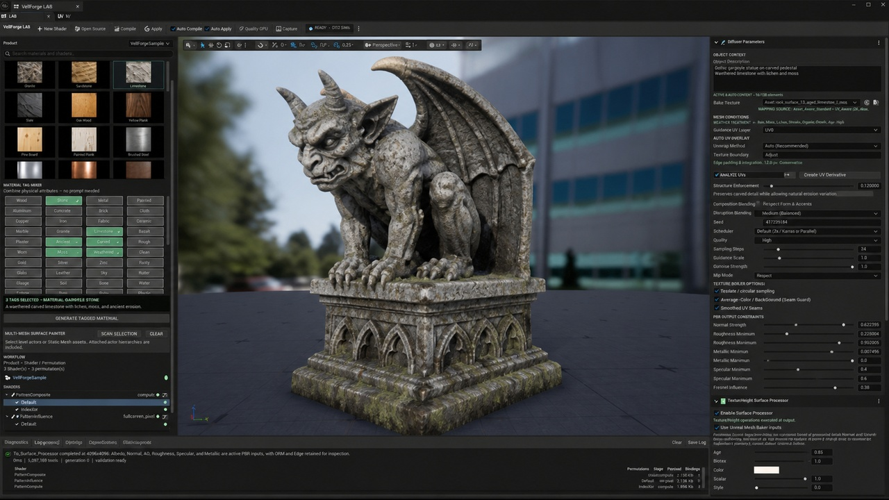

# VellForge LAB Texture Generation Guide



This guide explains how to texture an existing Unreal Engine Static Mesh with VellForge LAB and reach the quality bar shown in the [FAB screenshot set](https://www.fab.com/sellers/Bruno%20Xavier%20L). It covers the active **VellForge SDXL FinalCut 13GB FP32 / runtime ABI 8** workflow.

> VellForge generates textures and material instances; it does not generate the cliff, pillar, armor, weapon, furniture, sculpture, volcano, or character geometry. Start with a finished Static Mesh whose scale, silhouette, material slots, and UVs already support the intended result.

The FAB images are presentation targets. The control names and behavior documented below come from the current LAB implementation and are authoritative when a presentation image differs from the running application.

## Installation
# VellForge AI Texture Generator

VellForge creates textures and material instances for existing Static Meshes inside Unreal Engine. Use VellForge LAB to generate a material from a preset, combine material tags, transform an existing texture atlas, inspect UVs, and preview the result on your mesh.

Generation runs locally through native libraries loaded by the Unreal Editor. VellForge does not upload prompts or assets, download models automatically, or require a hosted inference service.

Documentation home: [vellforge.hkh-interactive.com](https://vellforge.hkh-interactive.com/).

## Start here

1. [Install VellForge and its prerequisites](installation.md).
2. [Install and verify the model pack](models.md).
3. [Generate your first material](workflows.md).
4. [Apply and customize the results](materials-and-customization.md).
5. [Resolve setup and generation problems](troubleshooting.md).

## What VellForge produces

The native generator produces Diffuse Albedo, Normal, Ambient Occlusion, Specular, and Roughness. The LAB publishes aligned 4096 × 4096 material textures through RealESRGAN upscaling. With the Surface Processor enabled, the final material uses Albedo, Normal, AO, Roughness, Specular, and Metallic; ORM and Edge are retained for inspection.

Diffuse Albedo is diffusion-generated. The other native output maps are aligned height/reflectance proxies derived from the contained diffuse. The Surface Processor can incorporate mesh-baker information. These outputs are not independently inferred physical measurements or a substitute for a high-poly bake.

VellForge generates surface appearance, not geometry, rigging, or animation. Start with a mesh that has suitable scale, material slots, and UVs. There is no generated Emissive map in the current workflow.

## Version covered

These pages describe the current Unreal Engine 5.8 Win64 integration and the FinalCut SDXL FP32 model profile, runtime ABI 8. Match the plugin package to the engine version specified by its release. The present model identity is a development profile; see the [model availability notes](models.md#download-sources-and-availability) before attempting a new installation.

The current native CUDA build targets NVIDIA Blackwell compute capability 12.0. Support for other GPU architectures must be established by a compatible native build; do not assume that every CUDA-capable GPU can run this package.


## What produces a strong result

The most important inputs, in order, are:

1. A strong model silhouette with useful bevels and enough geometric detail.
2. Clean, non-overlapping UVs with sensible texel density and adequate island padding.
3. Separate material slots for physically different surfaces such as metal, leather, wood, stone, and plastic.
4. A concise physical description that specifies scale, substrate, construction, and wear.
5. A reproducible nonzero seed after exploration.
6. Inspection of every generated PBR map, not only the lit viewport.

VellForge can improve surface appearance, but it cannot hide severely stretched UVs, replace missing geometry, or reliably place several unrelated materials into semantic regions of a single unlabelled atlas.

## Prerequisites

- Run the producer project with the installed stock Unreal Engine 5.8 build.
- Confirm that `VellForgeTool` and its producer-only LAB modules are enabled.
- Confirm that the local FinalCut model pack passes admission. VellForge does not download models or send prompts, meshes, or images to an online service.
- Import the target as a Static Mesh and verify its real-world scale, normals, tangents, and material slots.
- Save source meshes before opening the LAB. Auto UV work creates a derivative mesh rather than modifying the source asset.


## Open a mesh in VellForge LAB

Use either entry point:

1. In the Content Browser, right-click a Static Mesh and choose **Edit in VellForge LAB...**.
2. Open **Window > VellForge LAB**, select a Static Mesh in the Content Browser, and use the **+** button beside the preview **Mesh** selector.

Then:

1. Select the intended **Guidance UV Layer**. Most assets use `UV0`.
2. Confirm that the central preview shows the correct mesh and material slot.
3. Wait for the toolbar status to show **READY • DX12 SM6** before starting generation.
4. Leave the mesh and UV layer unchanged while a generation job is running. LAB rejects a completed atlas if its target changed during inference.

## Validate or repair the UVs

In **AUTO UV PREFLIGHT**:

1. Choose an **Unwrap Method**.
2. Set **Texture Resolution** to the intended atlas size for the preflight analysis.
3. Click **Analyze UVs**.
4. Resolve overlaps, degenerates, out-of-bounds islands, inadequate padding, and poor texel density before generating.
5. If repair is necessary, choose an appropriate method and click **Create UV Derivative**.

Useful unwrap choices include **Auto**, **HokkaidoUv**, **XAtlas**, **UVAtlas**, **PatchBuilder**, **Planar**, **Box**, **Cylindrical**, **RepackExisting**, and copying `UV1` or `UV2` to `UV0`.

The derivative is saved under `/Game/VellForgeGenerated/AutoUV`, selected for preview, and leaves the source mesh unchanged. Apply or discard any pending UV edits before generating; unapplied edits intentionally block the operation.

For rocks, statues, armor, and characters, prefer a real unwrap or repack over planar projection. Box and cylindrical projection are useful only when the object genuinely matches those projection shapes.

## Choose the correct generation workflow

### Preset Material Library

Use a preset when one material should cover the complete atlas: granite, sandstone, limestone, slate, walnut, oak, brushed steel, copper, rusted iron, worn leather, plastic, and similar surfaces.

Configure the Diffuser controls **before** clicking a preset tile. Clicking a tile immediately creates the working material, starts generation, publishes the result, and applies the generated material instance to the preview mesh.

For the standard atlas path, a preset supplies its own curated material brief. It does not combine with selected Material Tags, and it deliberately ignores **Object Description** so that geometry and UV guidance control placement without a conflicting scene prompt. Use the tag workflow when object-specific physical context is important.

### Material Tag Mixer

Use tags when the surface needs a custom material brief or a controlled mixture.

1. Enter a physical **Object Description**.
2. Select at least one base material tag.
3. Read the generated material brief shown beneath the tag grid.
4. Click **GENERATE TAGGED MATERIAL**.

The first selected material in catalog order acts as the primary substrate, the second as secondary structure, and later tags as accents or inclusions. Check the visible material brief rather than assuming click order.

Use actual material tags such as **Rock**, **Sandstone**, **Limestone**, **Marble**, **Steel**, **Iron**, **Bronze**, **Leather**, **Wood**, **Plastic**, **Paint**, **Patina**, **Rust**, and **Moss**. Put adjectives such as carved, monumental, weathered, chipped, volcanic, baroque, or toy-like in **Object Description**; they are not material tags.

### Base Texture transformation

Assign a Texture2D to **Base Texture** only when preserving or transforming an existing atlas.

- Empty **Base Texture** starts from a fresh latent and is best for a new material.
- Assigned **Base Texture** uses img2img. Start with **Denoise Strength** `0.75`; the recommended source-preserving range is `0.70–0.80`.
- Lower denoise preserves more source color and layout. Higher denoise permits larger changes and can drift from authored details.
- Describe the desired material change, not a new camera scene. For example: `Preserve every UV island and painted boundary; replace only the surface response with aged hammered bronze, subtle green patina in recesses, and fine directional scratches.`

VellForge uses the source atlas for initialization and structural guidance, then reapplies hard UV containment after decode and upscale. Exterior texels are preserved according to the approved mask rather than relying on prompt obedience alone.

### Multi-Mesh Surface Planner

Use **MULTI-MESH SURFACE PLANNER** for a selected level assembly, attached actor hierarchy, or mesh with several material slots.

1. Select the actors or Static Mesh assets.
2. Click **SCAN SELECTION**.
3. Review each detected material-slot classification and UV status.
4. Correct any classification that does not match the physical surface.
5. Load one row into LAB and generate that surface through the normal single-surface workflow.
6. Repeat for the remaining slots.

The planner does not alter the scene or generate every slot in one click. Its purpose is to make the per-surface plan explicit. Separate slots are the preferred approach for armor with leather straps, a bronze helmet with a leather liner, a hammer with a wrapped handle, or a toy with plastic, paint, and fabric parts.

## Recommended starting settings

Use this baseline for the first serious pass:

| Control | Start with | Guidance |
| --- | --- | --- |
| Internal Resolution | `1024 × 1024` | Best balance for iteration. All accepted outputs are published as aligned 4096 textures. |
| Seed | `0` while exploring | Zero randomizes once. Record the resolved seed, then enter that nonzero value for reproducible refinements. |
| Scheduler | `DPM++ 2M / Karras` | Active FinalCut default. |
| Quality | `Standard` | Use for 1024 iteration. `Quality` enforces at least 1536. |
| Sampling Steps | `16` | Active FinalCut default; more steps are not automatically better. |
| Guidance Scale | `5.0` | Active FinalCut default. Raise cautiously if the material brief is ignored. |
| Denoise Strength | `1.0` fresh latent; `0.75` Base Texture | Mesh preset/tag generation enforces a fresh-latent pass. Denoise is most useful for img2img. |
| Structure Enforcement | `0.08` | FinalCut default. Increase gradually only when the texture ignores UV/mesh structure. |
| Wrap Mode | `Clamp` | Correct for unique mesh atlases. |
| Tileable / circular sampling | Off | Mesh workflows force this off. Use tiling only for a deliberately seamless plane material. |
| Average-Color UV Background (Seam Guard) | On | Fills unused texels per map without changing covered UV texels. |
| Smooth UV Seams | Off for diagnosis | Enable for the final pass only if seams remain after the UVs and padding are correct. |
| Normal Strength | `1.0` | Reduce if fine detail looks inflated. |
| Roughness / Metallic / Specular limits | `0.0–1.0` | Tighten only when the material has a clear physical range. |
| Palette Influence | `1.0` | Reduce if palette control overwhelms material variation. |
| Enable Surface Processor | On | Produces the final processed material set. |
| Use Unreal Mesh Baker Inputs | On | Adds geometry-derived low-frequency normal, AO, curvature, and height information. |

For a final candidate, first lock the seed and compare a `1536 × 1536` **Quality** pass against the 1024 baseline. Reserve `2048 × 2048` for a justified hero asset: it costs substantially more time and memory, while the publication size remains 4096. Non-default scheduler, step, guidance, or resolution combinations are experimental until separately qualified.

## Write a useful Object Description

Describe the physical object, not a beauty-shot composition. A reliable brief contains:

`[object and construction]; [primary substrate]; [real-world surface scale]; [secondary material or finish]; [wear and where it accumulates]; [what must remain continuous].`

Good:

```text
Single monumental Corinthian pillar; pale veined marble at architectural scale; restrained gold mineral seams; carved acanthus capital; small age chips and dust with darker buildup only in recesses; continuous stone, not separate panels.
```

Avoid camera, depth-of-field, landscape, UI, pedestal, dramatic lighting, and background instructions. Those belong to the mesh presentation or the final FAB screenshot, not the texture atlas.

## Ten screenshot-target recipes

These are starting points. Generate each physical material slot separately when the asset has more than one substrate.

### 1. Cliff formation

- Preferred workflow: **Material Tag Mixer**
- Tags: **Rock + Sandstone + Moss**
- Tuning: Roughness minimum `0.65`; Metallic maximum `0.0`; Structure Enforcement `0.10–0.16` if strata do not follow the mesh.

```text
Large stratified coastal cliff formation; weathered granite and sandstone beds at meter scale; deep damp erosion fissures with sparse moss and pale lichen; continuous natural geology, not masonry blocks, tiles, or separate boulders.
```

### 2. Pillar

- Preferred workflow: **Material Tag Mixer**
- Tags: **Marble + Gold**
- Tuning: Roughness `0.28–0.72`; Metallic maximum `0.08` unless gold has its own material slot.

```text
Single monumental Corinthian architectural pillar; pale veined stone at architectural scale; restrained warm-gold mineral seams; carved acanthus capital; subtle age chips, dust, and darkened recesses; preserve continuous carved stone without panel seams.
```

If the gold is meant to be metal leaf rather than mineral veining, give it a separate material slot and generate it independently with **Gold** as the primary tag.

### 3. Temple

- Preferred workflow: **Material Tag Mixer**, one pass per stone or roof slot
- Tags for the main stone: **Sandstone + Limestone**
- Tuning: Roughness minimum `0.58`; Metallic maximum `0.0`.

```text
Classical Mediterranean hill temple built from large fitted blocks; warm sun-aged travertine-like sandstone and pale limestone at architectural scale; carved capitals, shallow tool marks, worn step edges, dust and restrained moss only in sheltered joints; coherent masonry, no miniature diorama texture.
```

### 4. Medieval armor chest

- Preferred workflow: **Multi-Mesh Surface Planner**
- Plate slot: **Steel + Rust**
- Strap and trim slots: **Leather**, then **Brass** or **Bronze** as separate passes

```text
Late-medieval articulated breastplate; hand-forged darkened steel plates with hammered microtexture, directional polishing on raised edges, shallow scratches, small impact dents, and restrained oxidation in joints; realistic armor scale and continuous metal, no stone or sci-fi circuitry.
```

Keep rust restrained. Large orange patches usually read as painted color instead of believable oxidation.

### 5. Massive fantasy war-hammer

- Preferred workflow: **Multi-Mesh Surface Planner**
- Head slot: **Iron + Rust**
- Grip slot: **Leather**
- Ornament slot: **Bronze** or **Gold**

```text
Massive forged fantasy war-hammer head; blackened iron with broad hammer marks, polished impact edges, deep engraved runes, fine battle scratches, and sparse rust only inside pits and recesses; heavy weapon scale, continuous forged metal, no rock texture.
```

### 6. Roman helmet

- Preferred workflow: **Multi-Mesh Surface Planner**
- Shell slot: **Bronze + Patina**
- Liner and straps: **Leather**
- Crest: use the actual fiber material slot, if present

```text
Ornate Roman ceremonial helmet shell; hammered bronze with warm metal variation, directional polishing, engraved relief, small edge nicks, and restrained green patina only in protected creases; historically plausible object scale, no stone grain or broad painted stains.
```

### 7. Tuscan / Baroque wooden dinner table

- Preferred workflow: **Material Tag Mixer**
- Tags: **Wood**; use **Walnut Wood** preset for a simpler single-material version
- Tuning: Roughness `0.24–0.62`; Metallic maximum `0.0`; keep grain at furniture scale.

```text
Large Tuscan Baroque dining table made from aged dark walnut; continuous directional grain following boards and carved legs, hand-planed waviness, softened edges, fine scratches and subtle wax polish, darker accumulation in carvings; premium furniture scale, no tree bark or randomly rotated grain.
```

### 8. Gargoyle stone sculpture

- Preferred workflow: **Material Tag Mixer**
- Tags: **Rock + Limestone + Moss**
- Tuning: Roughness minimum `0.68`; Metallic maximum `0.0`.

```text
Weathered Gothic gargoyle carved from pale limestone; chisel marks at sculpture scale, softened exposed edges, porous stone, rain-darkened recesses, small mineral stains, and sparse moss in sheltered creases; preserve readable facial carving and continuous stone.
```

### 9. Volcanic model

- Preferred workflow: **Material Tag Mixer**
- Tags: **Rock + Obsidian + Rust**
- Tuning: Roughness `0.38–0.92`; Metallic maximum `0.08`; strengthen structure only enough to keep crust aligned.

```text
Jagged volcanic cone and fractured lava field; charcoal basalt crust, glassy black obsidian faces, porous cooled lava, ash deposits, and narrow hot orange fissures following deep cracks; geological scale, no masonry, no separate floating rocks, no painted cartoon outlines.
```

The current VellForge material contract does not publish an Emissive map. Orange fissures can appear in Albedo, but real lava glow requires a separately authored emissive mask and material setup outside this generation workflow.

### 10. Stylized toy humanoid warrior

- Preferred workflow: **Multi-Mesh Surface Planner**
- Body and armor slots: **Plastic + Paint**
- Flexible parts: **Vinyl** or **Rubber**
- Tuning: Roughness `0.22–0.68`; keep normal strength below `0.75` if the toy surface becomes noisy.

```text
Stylized collectible humanoid warrior toy; injection-molded colored plastic with clean painted armor panels, subtle mold texture, controlled edge wear, tiny handling scratches, and soft vinyl accessories; readable toy scale, crisp color boundaries, no human skin pores, cloth weave, or photorealistic battle grime.
```

## Run, wait, and publish

1. Recheck the mesh, material slot, UV layer, Base Texture choice, tags or preset, seed, resolution, and constraints.
2. Start the job by clicking the desired preset tile or **GENERATE TAGGED MATERIAL**.
3. During inference, the toolbar reports **GENERATING • SDXL + CONTROLNET**. Use **CANCEL** only when necessary; cancellation is cooperative and can take time at a native phase boundary.
4. Do not change the target mesh or UV layer while the job is running.
5. On success, LAB automatically publishes the generated textures, builds a material instance, applies it to the preview, and continues through the enabled Surface Processor.

The standard output locations are:

- Generated maps: `/Game/VellForgeGenerated/Presets/<MeshName>/<CategoryName>/`
- Material instance: `/Game/VellForgeGenerated/Materials/<MeshName>/UV<N>/`
- Auto UV derivatives: `/Game/VellForgeGenerated/AutoUV/`

Generated asset names include part of the request cache hash. With the Surface Processor enabled, the active material inputs are Albedo, Normal, AO, Roughness, Specular, and Metallic; ORM and Edge remain available for inspection. Material IDs and Mesh Guidance are diagnostics. The raw provider contract derives its non-albedo maps deterministically from the final contained diffuse and geometry inputs; they are aligned material proxies, not an independent photogrammetry bake.

## Judge the result before keeping it

Inspect the actual generated material, not just the thumbnail:

- Rotate the mesh and check highlights across broad and grazing angles.
- Confirm that grain, pores, scratches, blocks, and chips have plausible real-world scale.
- Check every visible UV seam and mirrored island.
- Confirm that material transitions follow real slots or deliberate atlas regions.
- Inspect Albedo without lighting. Reject baked shadows, highlights, fake depth-of-field, scenery, pedestals, and UI-like shapes.
- Inspect Normal for inflated noise or inverted-looking details.
- Inspect Roughness and Specular for useful variation without salt-and-pepper noise.
- Confirm Metallic is near zero for stone, wood, leather, and plastic, and physically consistent for exposed metal.
- Confirm that no BRAZIL, Surface-ID, or guidance colors leaked into Albedo.
- Confirm that unused UV space is stable and seam-safe.
- Save the resolved seed and the final control values with the asset review notes.

Use the toolbar **Capture** command for a candidate image. The current implementation requests `Saved/Screenshots/VellForgeLab-Candidate.png`. For a FAB listing, compose the final 16:9 screenshot only after the material passes the map and seam checks above.

## Troubleshooting

### GENERATE TAGGED MATERIAL is disabled

Select at least one base material tag, finish or cancel the active job, and apply or discard pending UV edits.

### The preset started before the settings were ready

Preset tiles are action buttons, not passive selections. Wait for or cancel the active job, set all Diffuser controls first, and then click the preset.

### The result looks like scenery painted onto the object

Remove camera, environment, pedestal, lighting, and composition language. Describe only the object construction and physical surface. Use the tag workflow when object context matters.

### Texture scale is wrong

Confirm mesh import scale and texel density, then state the physical scale explicitly: `meter-scale geological strata`, `furniture-scale walnut grain`, `fine armor scratches`, or `subtle injection-mold texture`.

### Material regions land in the wrong places

Use separate material slots and the Multi-Mesh Surface Planner. A text prompt and structure guide cannot guarantee semantic separation between metal, leather, paint, and fabric on an ambiguous shared atlas.

### UV seams remain visible

Repair UV padding and distortion first. Keep **Average-Color UV Background** enabled. Enable **Smooth UV Seams** only for the final pass; it should not be used to disguise a broken unwrap.

### A Base Texture changed too much

Verify that the intended Texture2D is assigned, reduce denoise below `0.75`, use explicit preservation language, and keep the same seed while comparing variants.

### Generation fails before inference

Read the LAB diagnostic message. Common causes are an invalid UV layer, unreadable Base Texture source data, a model-pack hash or ABI mismatch, unsupported composition/reference controls, or a memory-budget rejection. Do not bypass admission or validation checks.

### The final pass is too slow or exceeds memory

Return to 1024 **Standard**, lock the material and seed there, and promote only the accepted candidate to 1536 **Quality**. A higher internal resolution is not a substitute for better UVs or a clearer material brief.


© 2026 The Hokkaido Hideout.